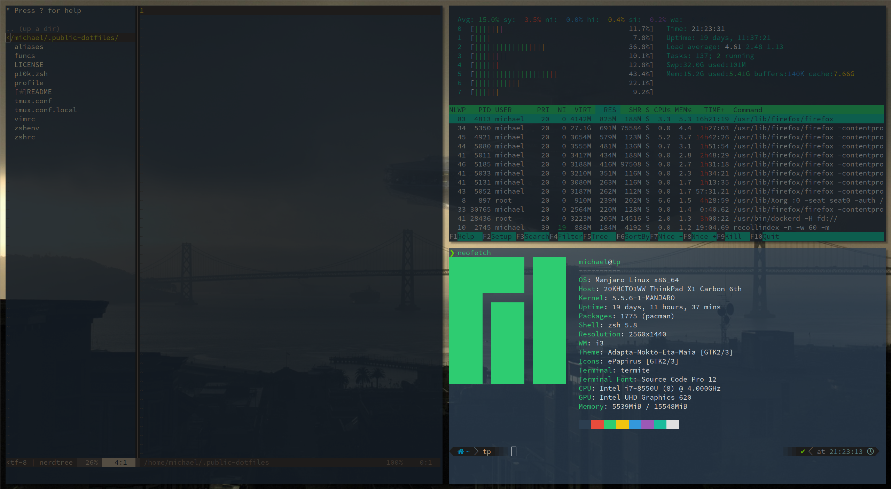

# Dotfiles

## Content

This repo contains my public

**Be aware that some configs require applications or scripts not in this repo -> adjust accordingly**

## NeoVim

My NeoVim config is in [its own repo](https://github.com/Allaman/nvim/)

### This dotfile repo works best with my [Ansible](https://www.ansible.com/) roles:

- [Shell setup](https://github.com/Allaman/ansible-role-dotfiles)
- [Package management](https://github.com/Allaman/ansible-role-packages)
- [Binaries](https://github.com/Allaman/ansible-role-binaries)
- [dotfiles](https://github.com/Allaman/ansible-role-dotfiles)

[Theme](https://github.com/EdenEast/nightfox.nvim/tree/main/extra/nightfox)
