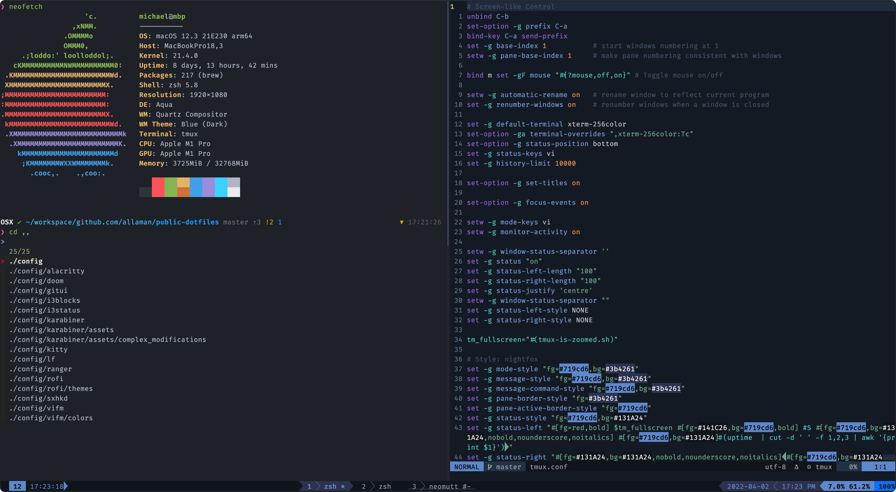

# Dotfiles

## Content

This repo contains my public dotfiles. This includes configuration and scripts. The config should be suitable for Linux and Mac machines.

**Be aware that some configs require applications or scripts not in this repo -> adjust accordingly**

## NeoVim

My NeoVim config is in [its own repo](https://github.com/Allaman/nvim/)

## Automatic configuration

I use [Ansible](https://www.ansible.com/) for automatic configuration of my devices:

- [rice](https://github.com/Allaman/rice) for my Arch Linux based configuration
- [mac-setup](https://github.com/Allaman/mac-setup) for my Mac based configuration
